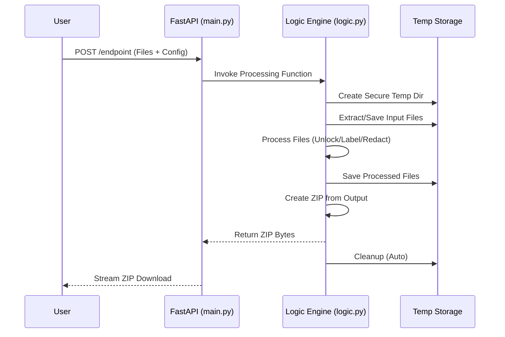

# Project Documentation: Discovery One-Stop API

## Overview
The **Discovery One-Stop API** is a FastAPI-based web service designed to automate legal document processing tasks. It provides a suite of tools for unlocking PDFs, organizing files by year, applying Bates stamps, generating discovery indexes, and redacting sensitive information.

## System Architecture

The application is structured into a clean separation of concerns:
- **`main.py`**: The API Gateway. It handles HTTP requests, file uploads, and response streaming.
- **`logic.py`**: The Core Engine. It contains all business logic, independent of the web framework.
- **Dependencies**: Uses `PyMuPDF`, `Pillow`, `ReportLab`, and `Pandas` for heavy lifting.

```mermaid
graph TD
    Client[External Client / Web App] -->|HTTP POST| API[FastAPI (main.py)]
    
    subgraph "Application Core"
        API -->|Calls| Logic[Business Logic (logic.py)]
        Logic -->|Uses| PDF[PyMuPDF / PyPDF2]
        Logic -->|Uses| IMG[Pillow / Tesseract OCR]
        Logic -->|Uses| XLS[Pandas / OpenPyXL]
    end
    
    subgraph "Storage / IO"
        Logic -->|Reads/Writes| Temp[Temporary Directory]
        Temp -->|Zips| Output[Output ZIP]
    end
    
    Output -->|Streamed Response| Client
```

## Data Flow

### 1. File Processing Pipeline
Most endpoints follow a "Swiss Army Knife" pattern: Input Files → Process → Output ZIP.



## API Endpoints

| Endpoint | Method | Description | Input | Output |
| :--- | :--- | :--- | :--- | :--- |
| `/unlock` | `POST` | Removes passwords from PDFs | PDFs/ZIP + Password | ZIP of Unlocked PDFs |
| `/organize` | `POST` | Sorts files into folders by year | PDFs/ZIP | ZIP of Folders |
| `/bates` | `POST` | Stamps Bates numbers on pages | PDFs/ZIP + Config | ZIP of Labeled Files |
| `/index` | `POST` | Generates Excel index from labeled files | Labeled ZIP | Excel (.xlsx) |
| `/redact` | `POST` | Redacts sensitive info (SSN, etc.) | PDF/ZIP + Patterns | ZIP of Redacted PDFs |

## Deployment Guide (Render)

This application is configured for deployment on **Render** as a Web Service.

### Prerequisites
1.  **GitHub Repository**: The code must be pushed to a GitHub repository.
2.  **Render Account**: Create an account at [render.com](https://render.com).

### Deployment Steps

1.  **New Web Service**:
    *   Go to the Render Dashboard.
    *   Click **New +** -> **Web Service**.
    *   Connect your GitHub repository.

2.  **Configuration**:
    Render will automatically detect the `render.yaml` file, but if you configure manually:
    *   **Runtime**: Python 3
    *   **Build Command**: `pip install -r requirements.txt`
    *   **Start Command**: `uvicorn main:app --host 0.0.0.0 --port $PORT`

3.  **System Dependencies**:
    The `packages.txt` file ensures that `poppler-utils` and `tesseract-ocr` are installed on the server. This is critical for PDF-to-Image conversion and OCR.

4.  **Environment Variables**:
    *   `PYTHON_VERSION`: `3.9.0` (or newer)
    *   `PORT`: (Set automatically by Render)

### Verification
Once deployed, Render will provide a URL (e.g., `https://discovery-app.onrender.com`).
*   Visit `https://discovery-app.onrender.com/docs` to see the interactive Swagger UI and test endpoints directly in the browser.

## Local Development

1.  **Install Dependencies**:
    ```bash
    pip install -r requirements.txt
    ```

2.  **Run Server**:
    ```bash
    uvicorn main:app --reload
    ```

3.  **Test**:
    Run the included test script:
    ```bash
    python test_api.py
    ```
